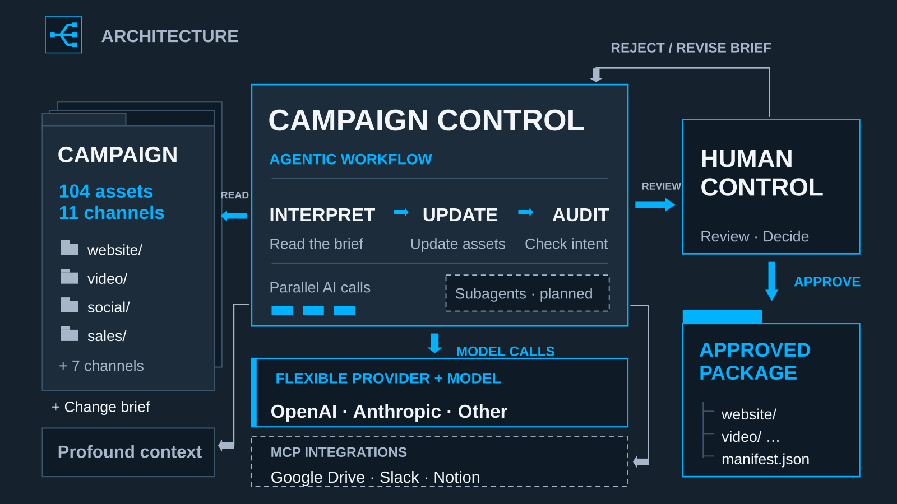

# Campaign Control

**Agentic campaign updates.**<br>
**Inhuman scale. Human control.**

A reusable campaign workbench: connect a campaign folder, describe a product change, review AI revisions and checks, then approve an exact version for the publishing team. Publishing stays with people.

Built at the **Profound Marketing Engineering Hackathon**.

## One package, your campaign

```text
campaign-control/
├── launch-control.config.json   Campaign location and AI provider/model
├── server.mjs, lib/, web/        The application
├── fictitious-ai/              Included fictional company example
│   ├── brand/                  Its identity, colors, and logo
│   └── campaigns/pro500/
│       ├── campaign.json       Asset inventory and product facts
│       ├── sources/            Editable inputs, where available
│       ├── assets/             Existing media and publisher metadata
│       ├── evidence/           Optional context you supply
│       ├── working/v001/       Candidate revisions and review files*
│       ├── releases/v001/      Approved publisher deliverables*
│       └── READY-TO-PUBLISH    Shortcut to the current approved release*
├── brand/                      Campaign Control default identity
├── docs/                       Design, research, and measurement
└── presentation/               Google Slides link and architecture preview
```

`*` Created by the workflow. Private state and approval history stay in the campaign’s hidden `.launch-control/` folder. The example media ships with the package; working versions, releases, private state, and readiness shortcuts are excluded from Git.

## Run locally

Requires **Node.js 22+**. Generating new videos or PDF collateral also requires **macOS and Swift/Xcode Command Line Tools**; the included MP4s and PDF are already rendered. No additional PDF package is needed.

Set `OPENAI_API_KEY` securely in your server environment, then run `npm start` from this directory. Open [localhost:8142](http://127.0.0.1:8142). Credentials are needed for live revisions, not for browsing the included campaign. The app does not automatically load `.env`.

[launch-control.config.json](launch-control.config.json) selects the campaign and model:

```json
{
  "schemaVersion": 1,
  "campaign": {
    "type": "local",
    "path": "./fictitious-ai/campaigns/pro500",
    "brand": "./fictitious-ai/brand/identity.json"
  },
  "ai": {"provider": "openai", "model": "gpt-6.1-sol"},
  "server": {"port": 8142}
}
```

The optional `campaign.brand` selects a company theme for the app and new renders. Omit it for Campaign Control defaults. [Brand ownership](docs/brand.md).

Point to an existing local campaign without moving its files:

```sh
npm start -- --campaign "/path/to/your/campaign"
```

That folder needs a `campaign.json` inventory mapping its current files. Editable sources are optional in the inventory; revising a required asset still needs a supported Markdown/plain-text source and renderer. Unsupported assets remain visible and block release. [Campaign mapping and configuration](docs/configuration.md).

OpenAI is the demo default; Anthropic is also supported. Set the provider and model in the config, with its API key only in the server environment. **Google Drive is a planned connector.** Selecting it currently returns a clear error. [Drive design](docs/google-drive-design.md).

## Draft → review → ready to publish

1. Open **Campaign Control**, choose **Pro500**, and let it check the existing inventory. The dashboard shows campaign readiness and counts; **Browse assets** opens all 104 assets.
2. Choose **Make an update** below the divider to reveal Maya’s preloaded, editable brief and release scope. Opening or hiding the brief makes no AI request and preserves your edits. That exact text goes to AI only when you choose **Update campaign**; AI interprets the requested facts before revising anything. Ambiguities stop the run.
3. **Demo mode**, beside **Local** in the header, defaults to off: update the full 104-asset campaign. Turn it on to update only four assets and their publisher files: website WEB002, video VID-001, social SOC-001, and sales SAL-004. The other 100 assets stay unchanged.
4. **Update campaign** creates `working/v001/`. Watch actual proposal, output, and audit counts plus processing time. Timing includes interpretation and corrections, excludes human review, and remains visible with the results.
5. Review the four before/after bundles, identified by asset ID and format. Use **Request revision** to describe a correction to one asset. AI revises that candidate, produces new files, and reruns the included campaign's checks; all review marks and approval reset. Earlier files and other asset outputs stay intact. Then mark the assets reviewed, confirm the interpreted facts, enter your name, and approve the exact version. Unresolved required findings prevent approval. Their IDs, reasons, and **Review issue** buttons appear beside approval. **Browse all included assets** opens the full inventory; filter **Needs attention** to find every blocker, including assets outside the four examples.
6. Download the publisher package or copy its folder path. `releases/v001/` and `READY-TO-PUBLISH` appear only after approval. Nothing is published.

Releases contain finished copy/media, metadata, captions, thumbnails, and an approval manifest. Sources and review evidence stay in the workspace. The home card reflects current readiness: updating, awaiting approval, needs attention, or launch ready. Demo releases are explicitly partial: their manifests record all exclusions and they never count as full-campaign approval. Both modes use the same live AI, output checks, and human approval. Demo mode does not supply canned results. The toggle selects the next update, locks during processing and result review, and defaults to off on page reload; an existing version always retains its recorded scope.

Asset feedback supports copy, publisher metadata, and the category label above ordinary HTML copy previews. For example: “Remove the duplicate SALES entry in the preview category label. Keep the rest unchanged.” That label belongs to the review preview, not the publisher's Markdown. Unsupported layout, footage, or native Slides requests remain blocked. **Reject version** records a rejection of the entire version; it does not send an asset correction to AI. The UI calls the included silent animated MP4s **Motion assets**; their inventory channel remains `video`.

For a fresh rehearsal, select **Reset demo** in the footer and **Archive & reset demo**. The bundled example returns to the original Pro500 inventory: no active revision, review marks, approval, release download, or readiness shortcut. The next update starts at `v001`; the brief resets and Demo mode returns to off. Original sources/media, brand, model settings and server credentials are preserved. Generated work and previous state move to `.launch-control/demo-archives/reset-001/` (then `reset-002`, etc.), excluded from Git and inaccessible through the app's artifact routes. This is a recoverable archive, not permanent deletion. The reset is unavailable during processing or for an external campaign folder. Restart the server after backend changes, then refresh the page to load the controls.

Starting another version clears current readiness and retains earlier releases. Full releases can become the next revision’s baseline; a partial release does not advance commercial facts across unrevised assets, so its next version starts from the campaign inputs. Input or output changes invalidate readiness when detected, on startup, and before download. Changes while the app is closed cannot clear a shortcut until it runs again.

If an AI audit flags a judgment you disagree with, use **Override AI finding**, enter your name and reason, and continue. The original finding stays visible and travels with the release record. **Exclude from launch** removes an asset and its companions from this release, with an explicit reason; **Include again** restores it. These decisions preserve completed reviews of unchanged assets. A representative asset you explicitly override is marked reviewed. Final release approval is still a separate human action. Missing files, failed output checks, and stale content cannot be overridden. Rechecking invalidates prior AI overrides. An excluded asset makes the package partial; it does not silently advance the whole campaign's product facts.



## Included example

**Fictitious AI**, a fictional product analytics company, changes **Pro500 → Pro1000**, **$500 → $1,000/month**, and **removes sharing** across **104 deliverables in 11 channels**. All originals include publisher metadata; there are six actual motion MP4s and a PDF sales battlecard. Neutral publisher routes keep the demo focused on offer changes rather than URL migration. The separate hackathon presentation remains in Google Slides. [Explore the campaign](fictitious-ai/campaigns/pro500/README.md).

The challenge exceeds find-and-replace: removing sharing can invalidate a promise that a colleague can continue an analysis. The hackathon demo used manually observed buyer-question context from the assigned Profound Mixpanel dataset. Those private observations are omitted from this public example; the workflow runs without them. You can supply permitted evidence from your own campaign. [Evidence workflow](docs/mixpanel-use.md).

## Verified runs and boundaries

Live runs at the hackathon used OpenAI `gpt-6.1-sol`:

| Scope | Processing time | Outcome |
| --- | ---: | --- |
| Four-asset walkthrough | 34.2 seconds | Ready for human review |
| Full campaign: 104 assets, 11 channels | 4 minutes 26.9 seconds | All automated checks passed; human approval produced the complete package |

These are local observations, not performance guarantees or measured business savings. Processing time excludes human review and packaging. The full run used 27 model requests with no retries. Its private run history and approved outputs are not distributed as precomputed results. Anthropic was also exercised live on the four-asset workflow. Model latency and results vary.

Run `npm test` for the automated checks. They use isolated synthetic providers and temporary campaigns, not paid API calls. The live asset-specific feedback stage still needs a separate model rehearsal; its software contracts are covered by automated tests.

**Implemented:** local campaign inventories, OpenAI/Anthropic adapters, bounded parallel calls, editable briefs, text and publisher-metadata revisions, native output generation, independent audits, asset feedback, human overrides/exclusions, and approval bound to exact files.

**Planned:** Google Drive, Slack and Notion connectors; additional provider adapters; dedicated autonomous subagents. The architecture illustration includes planned connections. The Profound API adapter is optional and has not been verified against a live account; the hackathon evidence was observed manually.

[Configuration](docs/configuration.md) · [Media formats](docs/media.md) · [Measurement plan](docs/campaign-scale-research.md) · [Public package and authorship](docs/public-package.md) · [Presentation](presentation/README.md)

## License

[Zero-Clause BSD (0BSD)](LICENSE). Use, modify and redistribute the original code and fictional example without an attribution requirement. Third-party services and trademarks retain their own terms.
