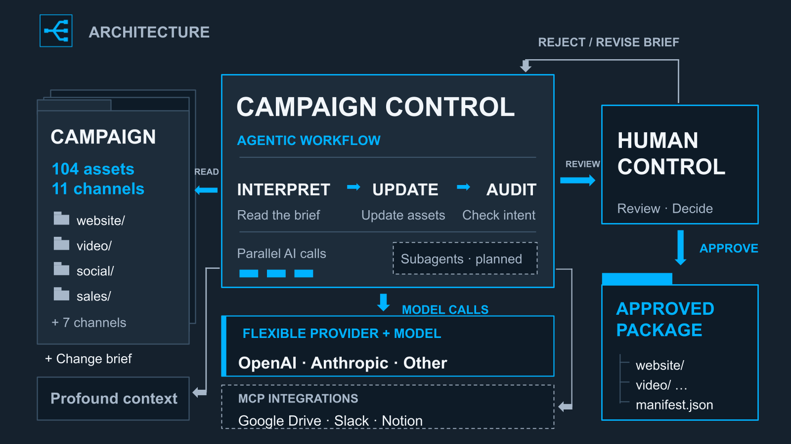

# Campaign Control presentation

The hackathon presentation was authored in native Google Slides. [Open the editable deck](https://docs.google.com/presentation/d/1wbPU51li7VvcwQp10r_y4cZuHopA5CIEIgmSvqUsKRQ/edit) (Google Drive access may be required; repository visibility does not change deck permissions).

The public architecture preview is included below. Google Drive, Slack, Notion, other model adapters and dedicated subagents are planned extensions; local files, OpenAI and Anthropic are implemented. Profound context in the live demo was manually observed, not fetched through a verified live integration.

[Editable architecture SVG](../docs/diagrams/campaign-control-architecture.svg) · [Capability boundaries](../README.md#verified-runs-and-boundaries)
